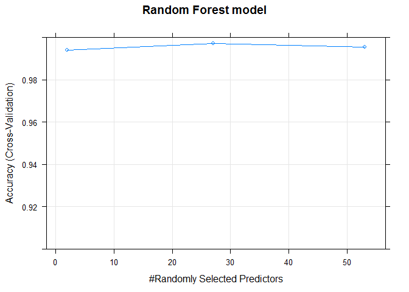
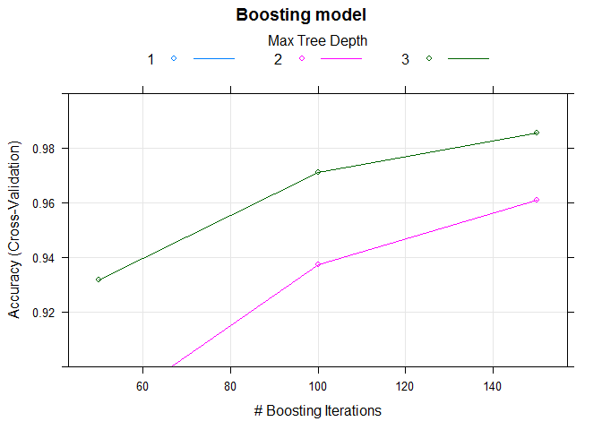

# BMR Practical Machine Learning Course Project - Human Activity Recognition
Bhuwanesh Man Rajbhandari  
April 29, 2016  

Executive Summary
===
Human Activity Recognition - HAR - has emerged as a key research area in the last years and is gaining increasing attention by the pervasive computing research community (see picture below, that illustrates the increasing number of publications in HAR with wearable accelerometers), especially for the development of context-aware systems. There are many potential applications for HAR, like: elderly monitoring, life log systems for monitoring energy expenditure and for supporting weight-loss programs, and digital assistants for weight lifting exercises. 

The goal of this project is to predict the manner in which they did the exercise. This is the "classe" variable in the training set. You may use any of the other variables to predict with. You should create a report describing how you built your model, how you used cross validation, what you think the expected out of sample error is, and why you made the choices you did. You will also use your prediction model to predict 20 different test cases.

Loading libraries
===

```r
library(caret)
```

```
## Loading required package: lattice
```

```
## Loading required package: ggplot2
```

```r
library(gbm)
```

```
## Loading required package: survival
```

```
## 
## Attaching package: 'survival'
```

```
## The following object is masked from 'package:caret':
## 
##     cluster
```

```
## Loading required package: splines
```

```
## Loading required package: parallel
```

```
## Loaded gbm 2.1.1
```

Loading Dataset
===
Dataset to develop model and validate model is downloaded from provided link.

The training data for this project are available here:
[training dataset](https://d396qusza40orc.cloudfront.net/predmachlearn/pml-training.csv)

The test data are available here:
[testing dataset](https://d396qusza40orc.cloudfront.net/predmachlearn/pml-testing.csv)

To load data to R, you can download it manually or by using following commands:

```r
train_file <- "pml-training.csv"
test_file <- "pml-testing.csv" 
train_url <- "https://d396qusza40orc.cloudfront.net/predmachlearn/pml-training.csv"
if (!file.exists(train_file)){
    download.file(train_url)    
}

test_url <- "https://d396qusza40orc.cloudfront.net/predmachlearn/pml-testing.csv"
if (!file.exists(test_file)){
    download.file(test_url)  
}
```

After downloading the dataset, load the dataset into R

```r
train_data <- read.csv(train_file, na.strings = c("#DIV/0!","NA"))
final_test_data <- read.csv(test_file, na.strings = c("#DIV/0!","NA"))
```

# Cleaning Data
First five columns(X,user_name,raw_timestamp_part_1, raw_timestamp_part_2, cvtd_timestamp) has no significance in building a prediction model. So, remove first five columns

```r
train_data <- subset(train_data, select = -(1:5))

# remove variables with nearly zero variance
zerovarIndex <- nearZeroVar(train_data)
train_data <- train_data[, -zerovarIndex]

# remove variables that are almost always NA
mostlyNA <- sapply(train_data, function(x) mean(is.na(x))) > 0.9
train_data <- train_data[, mostlyNA == F]
```

Model Building
===
I decided to use RandomForest model to see if it returns acceptable performance. I will be using `train` function in `caret` package to train the model and use 10-fold cross validation.

```r
#partition the dataset into train and test set
dataIndex <- createDataPartition(train_data$classe, p = 0.7, list = FALSE)
training_set <- train_data[dataIndex,]
testing_set <- train_data[-dataIndex,]

modelcontrol <- trainControl(method = "cv", number = 10, verboseIter = FALSE)
rfFit <- train(classe ~ ., method = "rf", data = training_set, trControl = modelcontrol)
```

```
## Loading required package: randomForest
```

```
## randomForest 4.6-12
```

```
## Type rfNews() to see new features/changes/bug fixes.
```

```
## 
## Attaching package: 'randomForest'
```

```
## The following object is masked from 'package:ggplot2':
## 
##     margin
```

Lets use boosting algorithm with 10-fold cross validation to predict classe.

```r
boostFit <- train(classe ~ ., method = "gbm", data = training_set, verbose = FALSE, trControl = modelcontrol)
```

```
## Loading required package: plyr
```

Random Forest vs Boosting Model Evaluation
===
Use the fitted model to predict the classe in testing dataset. Confusion matrix will compare predicted vs actual values.

```r
plot(rfFit, ylim = c(0.9, 1), main = "Random Forest model")
```

<!-- -->

```r
plot(boostFit, ylim = c(0.9, 1), main = "Boosting model")
```

<!-- -->

```r
# use the random forest model fitted to predict classe in testing set
rfFit_predicted <- predict(rfFit, newdata = testing_set)

# show confusion matrix to get estimate of out-of-sample error from prediction
confusionMatrix(testing_set$classe, rfFit_predicted)
```

```
## Confusion Matrix and Statistics
## 
##           Reference
## Prediction    A    B    C    D    E
##          A 1673    0    0    0    1
##          B    6 1129    3    1    0
##          C    0    6 1020    0    0
##          D    0    0    2  962    0
##          E    0    0    0    1 1081
## 
## Overall Statistics
##                                           
##                Accuracy : 0.9966          
##                  95% CI : (0.9948, 0.9979)
##     No Information Rate : 0.2853          
##     P-Value [Acc > NIR] : < 2.2e-16       
##                                           
##                   Kappa : 0.9957          
##  Mcnemar's Test P-Value : NA              
## 
## Statistics by Class:
## 
##                      Class: A Class: B Class: C Class: D Class: E
## Sensitivity            0.9964   0.9947   0.9951   0.9979   0.9991
## Specificity            0.9998   0.9979   0.9988   0.9996   0.9998
## Pos Pred Value         0.9994   0.9912   0.9942   0.9979   0.9991
## Neg Pred Value         0.9986   0.9987   0.9990   0.9996   0.9998
## Prevalence             0.2853   0.1929   0.1742   0.1638   0.1839
## Detection Rate         0.2843   0.1918   0.1733   0.1635   0.1837
## Detection Prevalence   0.2845   0.1935   0.1743   0.1638   0.1839
## Balanced Accuracy      0.9981   0.9963   0.9969   0.9988   0.9994
```

```r
# use the boosting model fitted to predict classe in testing set
boostFit_predicted <- predict(boostFit, newdata = testing_set)

# show confusion matrix to get estimate of out-of-sample error from prediction
confusionMatrix(testing_set$classe, boostFit_predicted)
```

```
## Confusion Matrix and Statistics
## 
##           Reference
## Prediction    A    B    C    D    E
##          A 1668    5    0    1    0
##          B   19 1104   14    2    0
##          C    0   29  995    1    1
##          D    0    1   11  952    0
##          E    0    5    1    9 1067
## 
## Overall Statistics
##                                           
##                Accuracy : 0.9832          
##                  95% CI : (0.9796, 0.9863)
##     No Information Rate : 0.2867          
##     P-Value [Acc > NIR] : < 2.2e-16       
##                                           
##                   Kappa : 0.9787          
##  Mcnemar's Test P-Value : NA              
## 
## Statistics by Class:
## 
##                      Class: A Class: B Class: C Class: D Class: E
## Sensitivity            0.9887   0.9650   0.9745   0.9865   0.9991
## Specificity            0.9986   0.9926   0.9936   0.9976   0.9969
## Pos Pred Value         0.9964   0.9693   0.9698   0.9876   0.9861
## Neg Pred Value         0.9955   0.9916   0.9946   0.9974   0.9998
## Prevalence             0.2867   0.1944   0.1735   0.1640   0.1815
## Detection Rate         0.2834   0.1876   0.1691   0.1618   0.1813
## Detection Prevalence   0.2845   0.1935   0.1743   0.1638   0.1839
## Balanced Accuracy      0.9937   0.9788   0.9841   0.9920   0.9980
```

From above comparison, random forest is the best model that can be used to fit the dataset. 
Out of Sample error
===

```r
## Calculate OOS Error
missClass = function(values, predicted) {
        sum(predicted != values) / length(values)
}
OOS_errRateRF = missClass(testing_set$classe, rfFit_predicted)
OOS_errRateRF
```

```
## [1] 0.003398471
```

Estimated out of sample error rate for the random forests model is 0.0033985 as reported by the final model.

Final Prediction
===
Finally, predicting the classe of testing dataset provided using the model selected and writing the result to files.

```r
# Creates a folder "predicted_output" in the work directory for storing the output

WorkDir <- getwd()
OpDir <- "predicted_output"
dir.create(file.path(WorkDir, OpDir))
```

```
## Warning in dir.create(file.path(WorkDir, OpDir)): 'C:\Users\i81266\Desktop
## \Coursera\Coursera_Work\8\BMR Practical Machine Learning Course Project
## Human Activity Recognition\predicted_output' already exists
```

```r
# predict on test set
preds <- predict(rfFit, newdata = final_test_data)

# convert predictions to character vector
preds <- as.character(preds)

# create function to write predictions to files
pml_write_files <- function(x) {
    n <- length(x)
    for (i in 1:n) {
        filename <- paste0("predicted_output/problem_id_", i, ".txt")
        write.table(x[i], file = filename, quote = FALSE, row.names = FALSE, col.names = FALSE)
    }
}

# create prediction files to submit
pml_write_files(preds)
```
